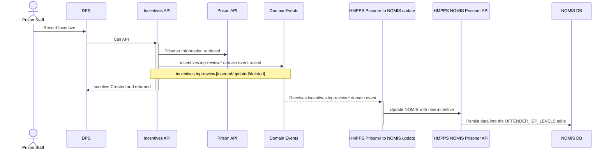
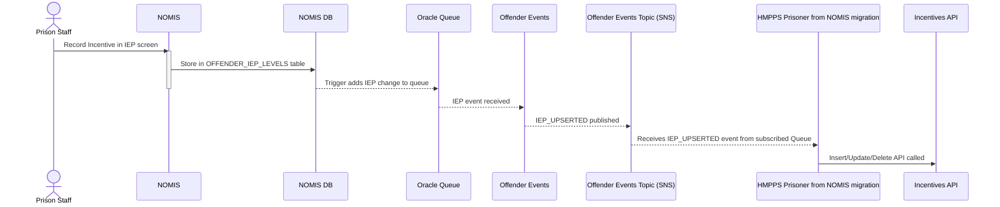
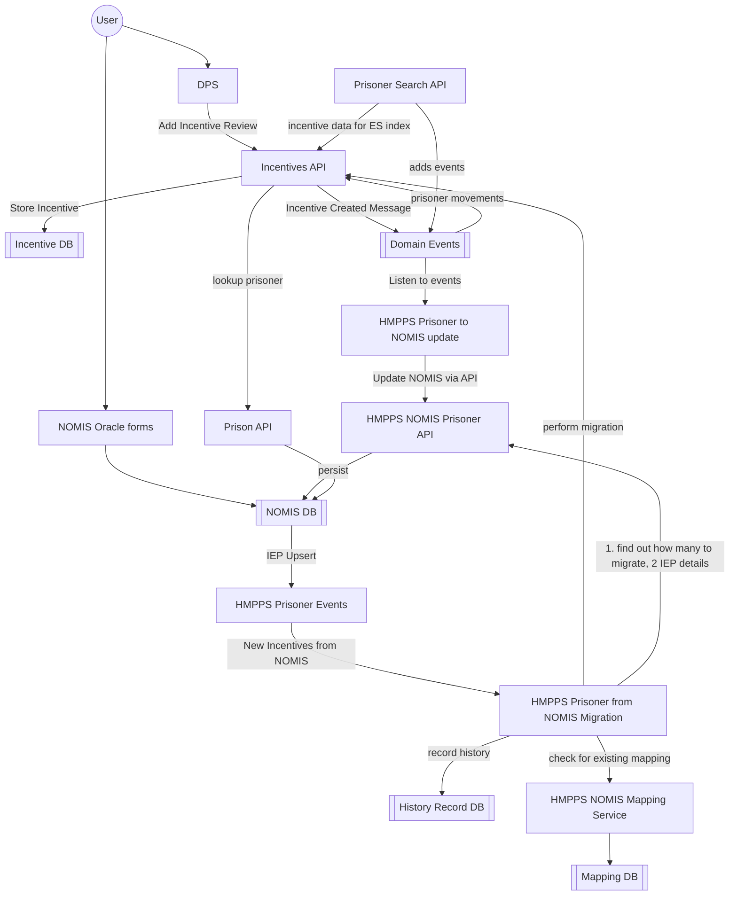

# 3. Two-way synchronisation between NOMIS and incentives service

[Next >>](9999-end.md)

Date: 2023-02-09

## Status

Accepted

## Context

In [ADR-0002](0002-incentive-api-architecture.md) the future scope was to synchronise data back into NOMIS. These sequence diagrams
detail the two way sync that is performed between systems

## Incentive creation in DPS
The resultant flow looks like

## Incentive creation in NOMIS
The resultant flow looks like

## Key components and their flow for Incentive management

[Next >>](9999-end.md)
