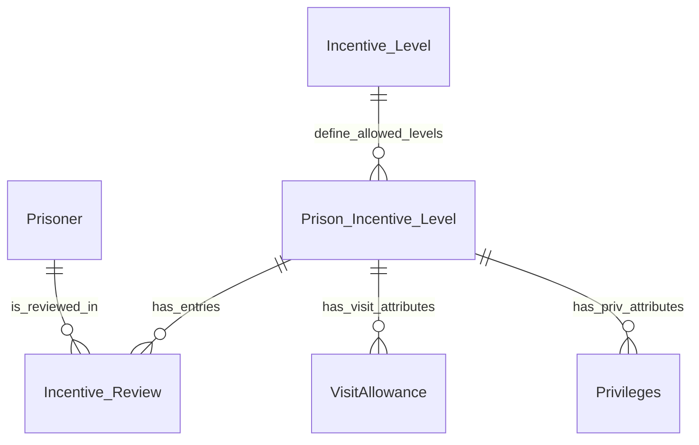
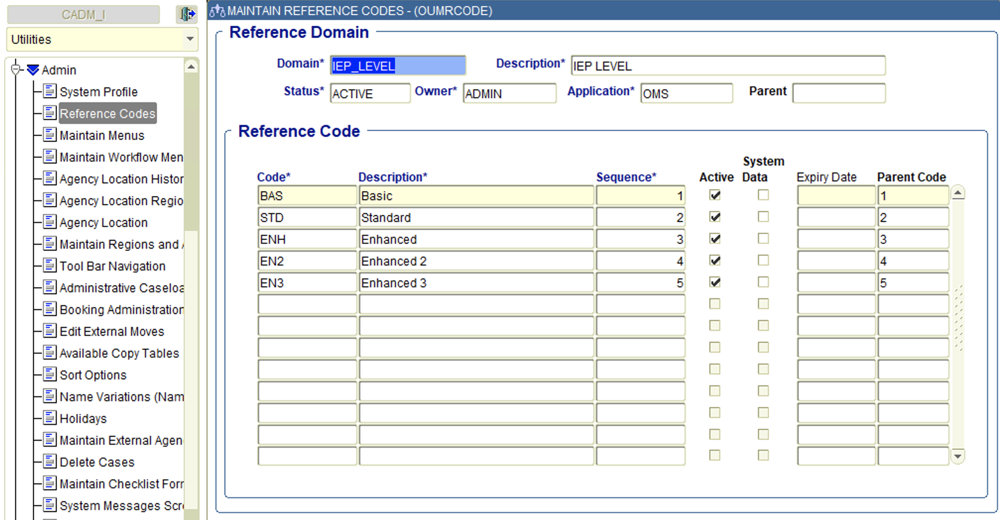
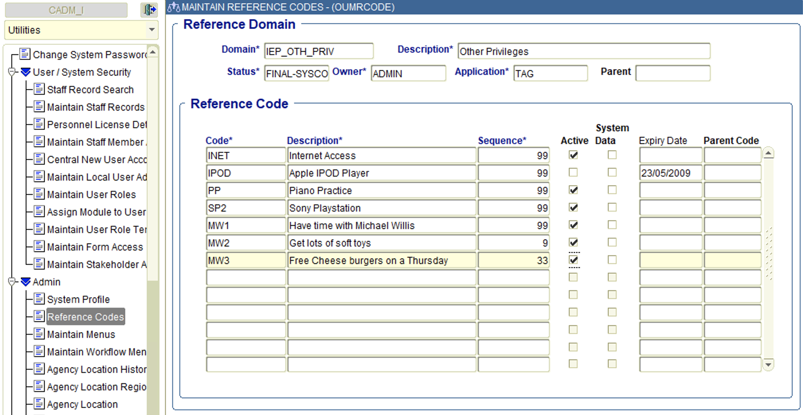
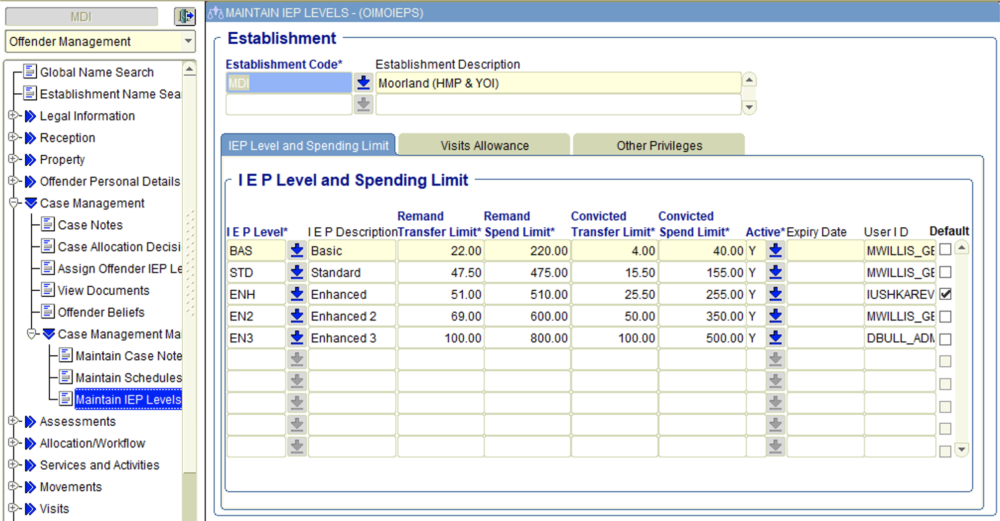
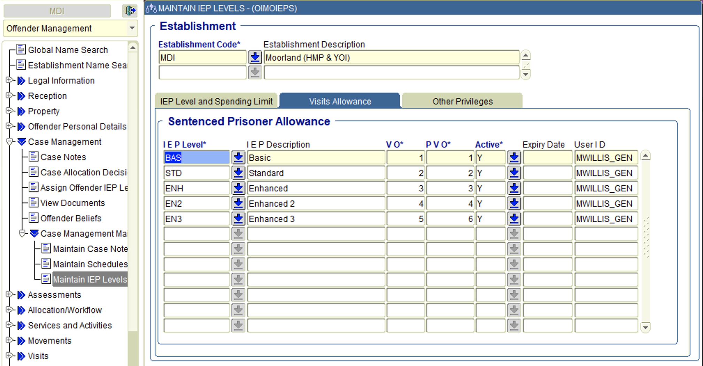
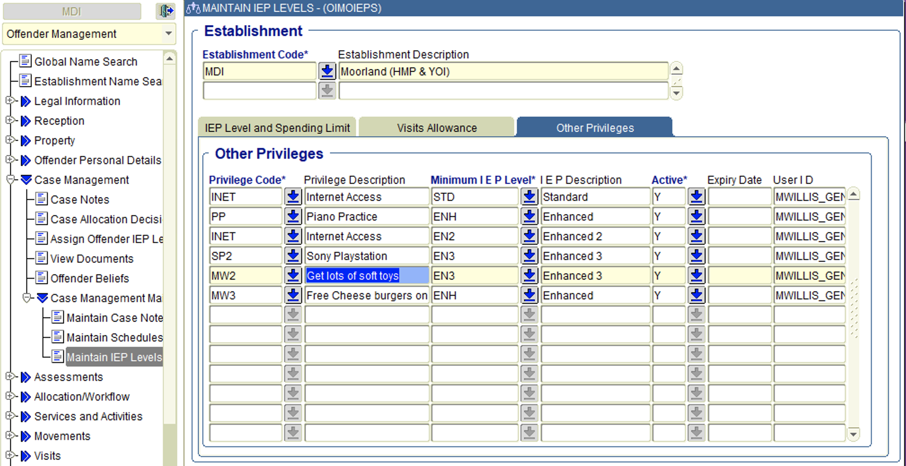

# 4. Mastering and Synchronisation of Incentive reference data

[Next >>](9999-end.md)


Date: 2023-03-05

## Status

Accepted

## Context

This document will cover the approach for the incentive service to master incentive reference data and synchronisation this information back into NOMIS

Reference data for incentives includes:-
- List of values for incentive levels for available to all prisons.  These are 
  - Basic (BAS), 
  - Standard (STD), 
  - Enhanced (ENH), 
  - Enhanced 2 (EN2), 
  - Enhanced 3 (EN3)
- List of incentive levels that apply to a prison
- Spends for each level in each prison
- Visit Allowances (VO and PVO)
- Other privileges

A logical schema of this data could be:-


### Tables Affected in **NOMIS**:

- REFERENCE_CODES for where `DOMAIN = 'IEP_LEVEL' OR DOMAIN = 'IEP_OTH_PRIV'`
```oracle
 CREATE TABLE "REFERENCE_CODES"
 (
   "DOMAIN"                        VARCHAR2(12)                      NOT NULL,
   "CODE"                          VARCHAR2(12)                      NOT NULL,
   "DESCRIPTION"                   VARCHAR2(40)                      NOT NULL,
   "LIST_SEQ"                      NUMBER(6, 0),
   "ACTIVE_FLAG"                   VARCHAR2(1)  DEFAULT 'Y'          NOT NULL,
   CONSTRAINT "REFERENCE_CODES_PK" PRIMARY KEY ("DOMAIN", "CODE")
 )
```
Levels are set with the DOMAIN of `IEP_LEVELS` as a central admin user on the Reference Codes screen  

The `IEP_OTH_PRIV` domain allows extra privileges to be added 


The **OIMOIEPS** NOMIS screen allows config of levels, visits and other privilages.

- IEP_LEVELS 
```oracle
  CREATE TABLE "IEP_LEVELS"
  (
    "IEP_LEVEL"                     VARCHAR2(12)                      NOT NULL,
    "AGY_LOC_ID"                    VARCHAR2(6)                       NOT NULL,
    "ACTIVE_FLAG"                   VARCHAR2(1)                       NOT NULL,
    "EXPIRY_DATE"                   DATE,
    "USER_ID"                       VARCHAR2(40),
    "DEFAULT_FLAG"                  VARCHAR2(1)                       NOT NULL,
    "REMAND_TRANSFER_LIMIT"         NUMBER(12, 2),
    "REMAND_SPEND_LIMIT"            NUMBER(12, 2),
    "CONVICTED_TRANSFER_LIMIT"      NUMBER(12, 2),
    "CONVICTED_SPEND_LIMIT"         NUMBER(12, 2),
    CONSTRAINT "IEP_LEVELS_PK" PRIMARY KEY ("IEP_LEVEL", "AGY_LOC_ID")
  )
```
This screen represents the IEP Levels 

- VISIT_ALLOWANCE_LEVELS (VO column is `REMAND_VISITS` and PVO column is `WEEKENDS`)

```oracle
 CREATE TABLE "VISIT_ALLOWANCE_LEVELS"
 (
   "IEP_LEVEL"                     VARCHAR2(12)                      NOT NULL,
   "AGY_LOC_ID"                    VARCHAR2(6)                       NOT NULL,
   "VISIT_TYPE"                    VARCHAR2(12)                      NOT NULL,
   "REMAND_VISITS"                 NUMBER(3, 0),
   "WEEKENDS"                      NUMBER(3, 0),
   "HOURS"                         NUMBER(3, 0),
   "ACTIVE_FLAG"                   VARCHAR2(1)                       NOT NULL,
   "EXPIRY_DATE"                   DATE,
   "USER_ID"                       VARCHAR2(40),
   CONSTRAINT "VISIT_ALLOWANCE_LEVELS_PK" PRIMARY KEY ("IEP_LEVEL", "AGY_LOC_ID", "VISIT_TYPE")
 )
```
This screen represents the Visit Allowances 


- OTHER_PRIVILEGES_LEVELS (column = `IEP_LEVEL`)

```oracle
CREATE TABLE "OTHER_PRIVILEGES_LEVELS"
(
  "PRIVILEGE_CODE" VARCHAR2(12) NOT NULL,
  "AGY_LOC_ID"     VARCHAR2(6)  NOT NULL,
  "IEP_LEVEL"      VARCHAR2(12) NOT NULL,
  "ACTIVE_FLAG"    VARCHAR2(1)  NOT NULL,
  "EXPIRY_DATE"    DATE,
  "USER_ID"        VARCHAR2(40),
  CONSTRAINT "OTH_LEV_IEP_LEV_PK" PRIMARY KEY ("PRIVILEGE_CODE", "AGY_LOC_ID", "IEP_LEVEL")
)
```

This screen represents the Other Privileges 

## Domain Events

### Reference Data Changes
When a change is made to reference data, one of two events can be fired.  In this instance the reference data will be one of type 
- IEP_LEVEL
- IEP_OTH_PRIV

#### Event Types:
In both instances the domain event will contain the code of the reference data.
- REFERENCE_DATA_INSERTED 
- REFERENCE_DATA_UPDATED

Note these should be the standard way of notifying about reference data changes for all NOMIS related reference data.
**Example:**
```json
{
  "eventType": "REFERENCE_DATA_INSERTED",
  "occurredAt": "2023-03-07T14:45:00",
  "version": "1.0",
  "description": "Reference data IEP Level added : EN4",
  "additionalInformation": {
    "referenceDomain": "IEP_LEVEL",
    "referenceCode": "EN4"
  }
}
```
### Prison Incentive Level Changes
These events are raised when changes are made to add or update incentive levels and associated data for a prison

#### Event Types:
- INCENTIVE_PRISON_LEVEL_INSERTED
- INCENTIVE_PRISON_LEVEL_UPDATED

**Example:**
```json
{
  "eventType": "INCENTIVE_PRISON_LEVEL_INSERTED",
  "occurredAt": "2023-03-07T15:45:00",
  "version": "1.0",
  "description": "Added EN4 to prison MDI",
  "additionalInformation": {
    "prisonId": "MDI",
    "incentiveLevel": "EN4"
  }
}
```

### Other privilege changes
Raised when new privileges are added or updated for a specified prison and incentive level.  *To be agreed that this event is needed.*

#### Event Types:
- OTHER_PRIVILEGES_LEVEL_INSERTED 
- OTHER_PRIVILEGES_LEVEL_UPDATED

**Example:**
```json
{
  "eventType": "OTHER_PRIVILEGES_LEVEL_INSERTED",
  "occurredAt": "2023-03-07T15:55:00",
  "version": "1.0",
  "description": "Added PS5 Prev to prison MDI for Level EN4",
  "additionalInformation": {
    "privilegeCode": "PS5",
    "prisonId": "MDI",
    "incentiveLevel": "EN4"
  }
}
```


## API endpoints


## Migration steps

1. Build API endpoints to read and write reference data
2. Syscon to build one way sync service to react to incentive reference data changes
3. Build API endpoints to one time migrate data
4. Build screens to support reference data
5. Setup roles for access to screens
6. Provide links to reference screens based on roles
7. Turn off **OIMOIEPS** screen (with config tool)
8. Disable editing of `IEP_LEVELS` and `IEP_OTH_PRIV` domain types in reference code screen **OUMIRCODE**
9. Migrate data


## Decision

This approach follows the agreed pattern of architecture for "Getting Off NOMIS"

## Consequences
Further investigation on whether other privileges are worth moving off NOMIS.

[Next >>](9999-end.md)
