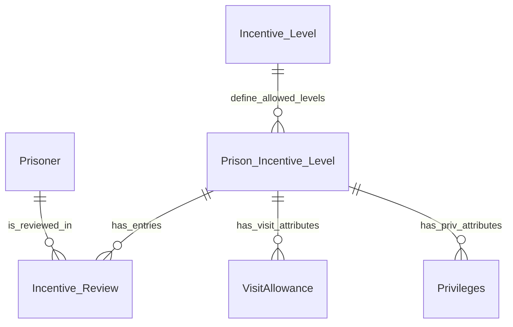
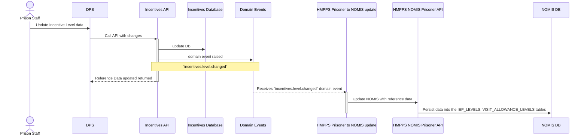

# 4. Mastering and Synchronisation of Incentive reference data

[Next >>](9999-end.md)


Date: 2023-03-05
Updated: 2023-03-29

## Status

Accepted

## Context

This document will cover the approach for the incentive service to master incentive reference data and synchronisation this information back into NOMIS

Reference data for incentives includes:-
- List of values for incentive levels for available to all prisons.  These are
  - Basic (BAS),
  - Standard (STD),
  - Enhanced (ENH),
  - Enhanced 2 (EN2),
  - Enhanced 3 (EN3)
- List of incentive levels that apply to a prison
- Spends for each level in each prison
- Visit Allowances (VO and PVO)
- Other privileges

A logical schema of this data could be:-


### Tables Affected in **NOMIS**:

- REFERENCE_CODES for where `DOMAIN = 'IEP_LEVEL' OR DOMAIN = 'IEP_OTH_PRIV'`
```oracle
 CREATE TABLE "REFERENCE_CODES"
 (
   "DOMAIN"                        VARCHAR2(12)                      NOT NULL,
   "CODE"                          VARCHAR2(12)                      NOT NULL,
   "DESCRIPTION"                   VARCHAR2(40)                      NOT NULL,
   "LIST_SEQ"                      NUMBER(6, 0),
   "ACTIVE_FLAG"                   VARCHAR2(1)  DEFAULT 'Y'          NOT NULL,
   CONSTRAINT "REFERENCE_CODES_PK" PRIMARY KEY ("DOMAIN", "CODE")
 )
```
Levels are set with the DOMAIN of `IEP_LEVELS` as a central admin user on the Reference Codes screen 

The `IEP_OTH_PRIV` domain allows extra privileges to be added 

**There are only 3 active privileges in production**

| Code | Description       | Active |
|------|-------------------|--------|
| INET | Internet Access   | Y      |
| IPOD | Apple IPOD Player | N      |
| PP   | Piano Practice    | Y      |
| SP2  | Sony Playstation  | Y      |


The **OIMOIEPS** NOMIS screen allows config of levels, visits and other privileges.

- IEP_LEVELS
```oracle
  CREATE TABLE "IEP_LEVELS"
  (
    "IEP_LEVEL"                     VARCHAR2(12)                      NOT NULL,
    "AGY_LOC_ID"                    VARCHAR2(6)                       NOT NULL,
    "ACTIVE_FLAG"                   VARCHAR2(1)                       NOT NULL,
    "EXPIRY_DATE"                   DATE,
    "USER_ID"                       VARCHAR2(40),
    "DEFAULT_FLAG"                  VARCHAR2(1)                       NOT NULL,
    "REMAND_TRANSFER_LIMIT"         NUMBER(12, 2),
    "REMAND_SPEND_LIMIT"            NUMBER(12, 2),
    "CONVICTED_TRANSFER_LIMIT"      NUMBER(12, 2),
    "CONVICTED_SPEND_LIMIT"         NUMBER(12, 2),
    CONSTRAINT "IEP_LEVELS_PK" PRIMARY KEY ("IEP_LEVEL", "AGY_LOC_ID")
  )
```
This screen represents the IEP Levels 

- VISIT_ALLOWANCE_LEVELS (VO column is `REMAND_VISITS` and PVO column is `WEEKENDS`)
- The `HOURS` column is always blank (except for 3 records created in 2008)
- The `VISIT_TYPE` is always `SENT_VISIT` (except for 3 records created in 2008)
```oracle
 CREATE TABLE "VISIT_ALLOWANCE_LEVELS"
 (
   "IEP_LEVEL"                     VARCHAR2(12)                      NOT NULL,
   "AGY_LOC_ID"                    VARCHAR2(6)                       NOT NULL,
   "VISIT_TYPE"                    VARCHAR2(12)                      NOT NULL,
   "REMAND_VISITS"                 NUMBER(3, 0),
   "WEEKENDS"                      NUMBER(3, 0),
   "HOURS"                         NUMBER(3, 0),
   "ACTIVE_FLAG"                   VARCHAR2(1)                       NOT NULL,
   "EXPIRY_DATE"                   DATE,
   "USER_ID"                       VARCHAR2(40),
   CONSTRAINT "VISIT_ALLOWANCE_LEVELS_PK" PRIMARY KEY ("IEP_LEVEL", "AGY_LOC_ID", "VISIT_TYPE")
 )
```
This screen represents the Visit Allowances 


- OTHER_PRIVILEGES_LEVELS (column = `IEP_LEVEL`)

```oracle
CREATE TABLE "OTHER_PRIVILEGES_LEVELS"
(
  "PRIVILEGE_CODE" VARCHAR2(12) NOT NULL,
  "AGY_LOC_ID"     VARCHAR2(6)  NOT NULL,
  "IEP_LEVEL"      VARCHAR2(12) NOT NULL,
  "ACTIVE_FLAG"    VARCHAR2(1)  NOT NULL,
  "EXPIRY_DATE"    DATE,
  "USER_ID"        VARCHAR2(40),
  CONSTRAINT "OTH_LEV_IEP_LEV_PK" PRIMARY KEY ("PRIVILEGE_CODE", "AGY_LOC_ID", "IEP_LEVEL")
)
```

This screen represents the Other Privileges 

In production there are only 12 records across all prisons for 1 privilege (Play Station PS2) for privileges and most records were added over 8 years ago.

| Code | Prison Id | Min Incentive Level | Active |
|------|-----------|---------------------|--------|
| SP2  | PKI       | ENH                 | Y      |
| SP2  | HDI       | ENH                 | Y      |
| SP2  | WDI       | ENH                 | Y      |
| SP2  | LEI       | ENH                 | N      |
| SP2  | LWI       | ENH                 | Y      |
| SP2  | FMI       | ENH                 | Y      |
| SP2  | CLI       | ENH                 | Y      |
| SP2  | IWI       | ENH                 | Y      |
| SP2  | SKI       | ENH                 | Y      |
| SP2  | WWI       | ENH                 | Y      |
| SP2  | HCI       | ENH                 | Y      |
| SP2  | SHI       | ENH                 | Y      |


## Domain Events

### Incentive Level Changes
When a change is made to a global incentive level one of two events can be fired.



#### Event Types:

- `incentives.level.changed`
Occurs when a specific incentive level is added or amended.  It will contain the incentiveLevel as an attribute.

##### Callback:

`GET /incentive/levels/{incentiveLevel}`

#### Example:
```json5
{
  "eventType": "incentives.level.changed",
  "occurredAt": "2023-03-07T14:45:00",
  "version": "1.0",
  "description": "An incentive level has been changed : EN4",
  "additionalInformation": {
    "incentiveLevel": "EN4"
  }
}
```

- `incentives.levels.reordered` Occurs when the incentive levels are reordered.  No level issued as all levels affected.

#### Callback:

`GET /incentive/levels?with-inactive=true`

##### Example:

```json5
{
  "eventType": "incentives.level.reordered",
  "occurredAt": "2023-03-07T14:45:00",
  "version": "1.0",
  "description": "Incentive levels have been re-ordered"
}
```

### Prison Incentive Level Changes

These events are raised when changes are made to add or update incentive levels and associated data for a prison

#### Event Types:

incentives.prison-level.changed

##### Callback:

`GET /incentive/prison-levels/{prisonId}/level/{incentiveLevel}`

##### Example:

```json5
{
  "eventType": "incentives.prison-level.changed",
  "occurredAt": "2023-03-07T15:45:00",
  "version": "1.0",
  "description": "Incentive level EN4 in prison MDI has been updated",
  "additionalInformation": {
    "prisonId": "MDI",
    "incentiveLevel": "EN4"
  }
}
```

## API endpoints

### Read endpoints for incentive levels and prisons’ associated information

Authorised requests do not require any roles.

#### Get a list of active incentive levels globally of all prisons
`GET /incentive/levels` -
```json5
[
  {
    "code": "BAS",
    "name": "Basic",
    "active": true,
    "required": true
  },
  {
    "code": "STD",
    "name": "Standard",
    "active": true,
    "required": true
  },
  // more entries…
]
```

#### Get a list of all incentive levels globally of all prisons
`GET /incentive/levels?with-inactive=true` -
```json5
[
  {
    "code": "BAS",
    "name": "Basic",
    "active": true,
    "required": true
  },
  {
    "code": "STD",
    "name": "Standard",
    "active": true,
    "required": true
  },
  // more entries…
  {
    "code": "ENT",
    "name": "Entry",
    "active": false,
    "required": false
  }
]
```

#### Get details of an incentive level globally
NB: Inactive levels are also returned

`GET /incentive/levels/{code}` -
```json
{
  "code": "BAS",
  "name": "Basic",
  "active": true,
  "required": true
}
```

#### Get the details of all active incentive levels for a specified prison
This contains spend limits and visit allowances

`GET /incentive/prison-levels/{prisondId}` -

e.g. **/incentive/prison-levels/MDI** returns
```json5
[
  {
    "levelCode": "STD",
    "levelName": "Standard",
    "prisonId": "MDI",
    "active": true,
    "defaultOnAdmission": true,
    "remandTransferLimitInPence": 5500,
    "remandSpendLimitInPence": 55000,
    "convictedTransferLimitInPence": 1800,
    "convictedSpendLimitInPence": 18000,
    "visitOrders": 2,
    "privilegedVisitOrders": 1
  },
  // more entries…
]
```

#### Get the details of all active incentive levels for a specified prison
This response is the same as above but includes `"active": false`

`GET /incentive/prison-levels/{prisondId}?with-inactive=true`

#### Get the details of an incentive level for a specified prison
This contains spend limits and visit allowances.
NB: Inactive levels are also returned

`GET /incentive/prison-levels/{prisondId}/level/{level}` -

e.g. **/incentive/prison-levels/MDI/level/STD** returns
```json
{
  "levelCode": "STD",
  "levelName": "Standard",
  "prisonId": "MDI",
  "active": true,
  "defaultOnAdmission": true,
  "remandTransferLimitInPence": 5500,
  "remandSpendLimitInPence": 55000,
  "convictedTransferLimitInPence": 1800,
  "convictedSpendLimitInPence": 18000,
  "visitOrders": 2,
  "privilegedVisitOrders": 1
}
```


### Write endpoints for reference data

Authorised requests will require roles with write scope.

#### Add a new incentive level
`POST /incentive/levels` -
```json
{
  "code": "EN4",
  "name": "Enhanced 4",
  "active": true
}
```

#### Update an existing incentive level
`PUT /incentive/levels/{code}` -
```json
{
  "code": "STD",
  "name": "Silver",
  "active": true
}
```

`PATCH /incentive/levels/{code}` -
```json
{
  "name": "Silver"
}
```

#### Deactivate an existing incentive level

`DELETE /incentive/levels/{code}`

#### Change order of incentive levels globally

`PATCH /incentive/level-order` -
```json
["BAS", "ENT", "STD", "ENH", "EN2", "EN3"]
```

#### Update an incentive level’s associated information in a prison

`PUT /incentive/prison-levels/{prisonId}/level/{levelCode}` -
```json
{
  "levelCode": "STD",
  "levelName": "Standard",
  "prisonId": "MDI",
  "active": true,
  "defaultOnAdmission": true,
  "remandTransferLimitInPence": 5500,
  "remandSpendLimitInPence": 55000,
  "convictedTransferLimitInPence": 1800,
  "convictedSpendLimitInPence": 18000,
  "visitOrders": 2,
  "privilegedVisitOrders": 1
}
```

`PATCH /incentive/prison-levels/{prisonId}/level/{levelCode}` -
```json
{
  "remandTransferLimitInPence": 5500,
  "remandSpendLimitInPence": 55000
}
```

#### Deactivate all levels in a prison

`DELETE /incentive/prison-levels/{prisonId}`

#### Deactivate a level in a prison

`DELETE /incentive/prison-levels/{prisonId}/level/{levelCode}`

## Migration steps

1. Build API endpoints to read and write reference data
2. SYSCON to build one way sync service to react to incentive reference data changes
3. Build screens to support reference data
4. Setup roles for access to screens
5. Provide links to reference screens based on roles
6. Migrate data manually
7. Turn off **OIMOIEPS** screen (with config tool)
8. Disable editing of `IEP_LEVELS` domain types in reference code screen **OUMIRCODE** (optional)


## Decision
- Other privileges data will NOT be moved off NOMIS as it is not used
- SYSCON will not migrate data - a one-off SQL script will set-up the data in the incentive DB
- One way sync only will be performed
- NOMIS screens can be turned off / made read only - but timescale is not urgent as this data changes very infrequently


## Consequences


[Next >>](9999-end.md)
